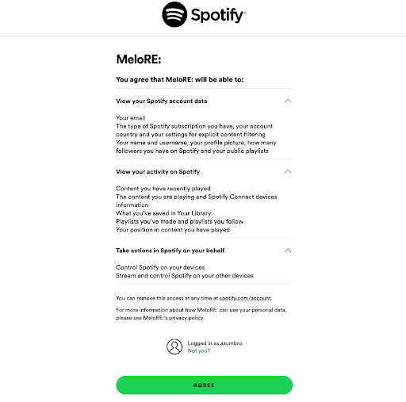
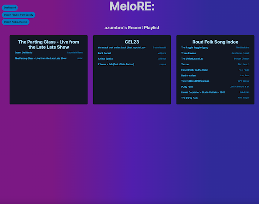

# MeloRe:

[License](https://opensource.org/licenses/MIT)

## Table of Contents
    
- [Description](#description)
- [Installation](#installation)
- [Usage](#usage)
- [License](#license)
- [Authors](#author)
- [Questions](#questions)
    
## Description
    
This application reads user data from Spotify and imports their playlists. Then it will show the properties of the playlist and if an individual song is selected, it will display the properties of the individual song in text and in graph form.
    
[MeloRE:](https://melore.herokuapp.com/)
    
## Installation
    
To install the project, navigate to the associated GitHub account and clone down the project. Run an npm i for all of the necessary technologies. Request testing authorization from one of the team members so that they can add your email to the Spotify authorization account.

  ```sh
  npm install
  ```
    
## Usage
    
To use the application, navigate to the deployed website. Authorize Spotify to connect to the application and import your playlists. The playlists should populate on the page and the user is then able to navigate through the rest of the site.

  
    
## License
    
Copyright <2023> 

    Permission is hereby granted, free of charge, to any person obtaining a copy of this software and associated documentation files (the “Software”), to deal in the Software without restriction, including without limitation the rights to use, copy, modify, merge, publish, distribute, sublicense, and/or sell copies of the Software, and to permit persons to whom the Software is furnished to do so, subject to the following conditions:
    
    The above copyright notice and this permission notice shall be included in all copies or substantial portions of the Software.
    
    THE SOFTWARE IS PROVIDED “AS IS”, WITHOUT WARRANTY OF ANY KIND, EXPRESS OR IMPLIED, INCLUDING BUT NOT LIMITED TO THE WARRANTIES OF MERCHANTABILITY, FITNESS FOR A PARTICULAR PURPOSE AND NONINFRINGEMENT. IN NO EVENT SHALL THE AUTHORS OR COPYRIGHT HOLDERS BE LIABLE FOR ANY CLAIM, DAMAGES OR OTHER LIABILITY, WHETHER IN AN ACTION OF CONTRACT, TORT OR OTHERWISE, ARISING FROM, OUT OF OR IN CONNECTION WITH THE SOFTWARE OR THE USE OR OTHER DEALINGS IN THE SOFTWARE.
    
## Authors

Austin Zumbro  
[GitHub](https://github.com/austinzumbro/)      
David Chung  
[GitHub](https://github.com/dchung13/)  
Bryan Nguyen  
[GitHub](https://github.com/bryannguyen9/)  
Emanuel Molina  
[GitHub](https://github.com/AcquahLopid/)  

    
## Questions
If you have any questions, our GitHubs are [David](https://github.com/dchung13/), [Austin](https://github.com/austinzumbro/), [Bryan](https://github.com/bryannguyen9/), [Emanuel](https://github.com/AcquahLopid/).  
You can also reach us by email at [dchung20315@gmail.com](dchung20315@gmail.com), [azumbro@gmail.com](azumbro@gmail.com), [Emanuel.Molina2k@gmail.com](Emanuel.Molina2k@gmail.com), [bryannguyn9@yahoo.com](bryannguyn9@yahoo.com).  

